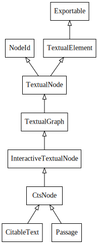

MyCapytain's Main Objects Explained
===================================

Exportable Parent Classes
#########################

Description
***********

:class:`MyCapytain.common.constants.Exportable`

The Exportable class is visible all across the library. It provides a common, standardized way to retrieve in an API \
fashion to what can an object be exported and to exports it. Any exportable object should have an EXPORT_TO constant \
variable and include a __export__(output, **kwargs) methods if it provides an export type.

Example
*******

The following code block is a mere example of how to implement Exportable and what are its responsibilities. Exportable\
typically loops over all the parents class of the current class until it find one exportable system matching the \
required one.

.. literalinclude:: Exportable.py
   :language: python
   :linenos:

Retrievers
##########

:class:`MyCapytain.retrievers.prototypes.API`

Description
***********

Retrievers are classes that help build requests to API and return standardized responses from them. There is no real \
perfect prototypes. The only requirements for a Retriever is that its query function should returns string only. It is \
not the role of the retrievers to parse response. It is merely to facilitate the communication to remote API most of \
the time.

Recommendations
***************

For Textual API, it is recommended to implement the following requests

- getTextualNode(textId[str], subreference[str], prevnext[bool], metadata[bool])
- getMetadata(objectId[str], \*\*kwargs)
- getSiblings(textId[str], subreference[str])
- getReffs(textId[str], subreference[str], depth[int])

Example of implementation : CTS 5
*********************************

:class:`MyCapytain.retrievers.cts5.CTS`

.. literalinclude:: Retriever.py
   :language: python
   :linenos:

Text and Passages
#################

Description
***********

Hierarchy
---------

The generic idea of both Text and Passage's classes is that they inherit from a longer trail of text bearing object \
that complexified over different features. The basic is

- *TextualElement* is an object which can bear Metadata and Collection information. It has a .text property \
and is exportable
- *TextualNode* inherits from NodeId and unlike TextualElement, TextualNode is part of a graph of CitableObject. It bears\
informations about its siblings, parents, children.
- *TextualGraph* is a bit interactive : you can query for children nodes and get descendant references of the object.
- *InteractiveTextualNode* is completely interative . You can browse the graph by accessing the :code:`.next` property\
for example : it should then return an InteractiveTextualNode as well
- *CTSNode* has two unique methods more as well as a :code:`urn` property.
- From *CTSNode* we find *CitableText* and *Passage*, which represents complete and portion of a Text. The main \
difference is that CitableText has no parents, no siblings.

    Prototype of Texts from :module:`MyCapytain.resources.prototypes.text`. \
    :class:`NodeId` and :class:`Exportable` are respectively from :module:`MyCapytain.common.reference` and \
    :module:`MyCapytain.common.constants`.

Objectives
----------

Text and Passages object have been built around InteractiveTextualNode which fills the main purpose of MyCapytain :\
being able to interact with citable, in-graph texts that are retrieve through web API or local files. Any \
implementation should make sure that the whole set of navigation tool are covered. Those are :

+---------------------------------------------+----------------------------------------------------------------------+-----------------------------------+-------------------------------------------------------------+
| Tree Identifiers
(Returns str Identifiers)  | Tree Navigations
(Returns InteractiveTextualNode or children class)  | Retrieval Methods                 | Other                                                       |
+=============================================+======================================================================+===================================+=============================================================+
| prevId                                      | prev                                                                 | .getTextualNode(subreference)     | id : TextualNode Identifier [str]                           |
+---------------------------------------------+----------------------------------------------------------------------+-----------------------------------+-------------------------------------------------------------+
| nextId                                      | nextId                                                               | .getReffs(subreference[optional]) | metadata : Metadata informations [Metadata]                 |
+---------------------------------------------+----------------------------------------------------------------------+-----------------------------------+-------------------------------------------------------------+
| siblingsId [tuple[str]]                     | siblings [tuple[InteractiveTextualNode]]                             |                                   | about : Collection Information [Collection]                 |
+---------------------------------------------+----------------------------------------------------------------------+-----------------------------------+-------------------------------------------------------------+
| parentId                                    | parent                                                               |                                   | citation : Citation Information [Citation]                  |
+---------------------------------------------+----------------------------------------------------------------------+-----------------------------------+-------------------------------------------------------------+
| childIds [list[str]]                        | children [list[InteractiveTextualNode]]                              |                                   | text : String Representation of the text without annotation |
+---------------------------------------------+----------------------------------------------------------------------+-----------------------------------+-------------------------------------------------------------+
| firstId                                     | first                                                                |                                   | .export()                                                   |
+---------------------------------------------+----------------------------------------------------------------------+-----------------------------------+-------------------------------------------------------------+
| lastId                                      | last                                                                 |                                   |                                                             |
+---------------------------------------------+----------------------------------------------------------------------+-----------------------------------+-------------------------------------------------------------+
|                                             |                                                                      |                                   |                                                             |
+---------------------------------------------+----------------------------------------------------------------------+-----------------------------------+-------------------------------------------------------------+

The encodings module
********************

The encoding module contains special implementations : they technically do not support interactive methods but \
provides generic parsing and export methods for specific type of contents such as TEI XML object or other formats \
such as json, csv, treebank objects in the future.

The :class:`TEIResource` for example requires the object to be set up with a resource parameters that will be further\
parsed using lxml. From there, it provides export such as plain/text, TEI XML, nested dictionaries or even an\
lxml etree interface.

Implementation example : HTTP API Passage work
**********************************************

Other Example
*************

See :ref:`MyCapytain.local`

Collection
##########

Description
***********

Collections are the metadata containers object in MyCapytain. Unlike other object, they will never contain textual \
content such as Texts and Passages but will in return help you browse through the catalog of one APIs collection and \
identify manually or automatically texts that are of relevant interests to you.

The main informations that you should be interested in are :
- Collections are children from Exportable. As of 2.0.0, any collection can be exported to JSON DTS.
- Collections are built on a hierarchy. They have children and descendants
- Collections have identifiers and title (Main name of what the collection represents : if it's an author, it's her \
name, a title for a book, a volume label for a specific edition, etc.)
- Collections can inform the machine if it represents a readable object : if it is readable, it means that using its \
identifier, you can query for passages or references on the same API.

Main Properties
***************

- Collection().id : Identifier of the object
- Collection().title : Title of the object
- Collection().readable : If True, means that the Collection().id can be used in GetReffs or GetTextualNode queries
- Collection().members : Direct children of the object
- Collection().descendants : Direct and Indirect children of the objects
- Collection().readableDescendants : Descendants that have .readable as True
- Collection().export() : Export Method
- Collection().metadata : Metadata object that contain flat descriptive localized informations about the object.

Implementation : CTS Collections
********************************

.. note:: For a recap on what Textgroup means or any CTS jargon, go to http://capitains.github.io/pages/vocabulary

CTS Collections are divided in 4 kinds : TextInventory, TextGroup, Work, Text. Their specificity is that the hierarchy\
of these objects are predefined and always follow the same order. They implement a special export (\
:code:`MyCapytain.common.constants.Mimetypes.XML.CTS`) which basically exports to the XML Text Inventory Format\
that one would find making a GetCapabilities request.

CapiTainS CTS Collections implement a parents property which represent a list of parents where .parents' order is equal\
to :code:`Text.parents = [Work(), TextGroup(), TextInventory()]`).

Their finale implementation accepts to parse resources through the :code:`resource=` named argument.

Example
*******

.. literalinclude:: Collections.py
   :language: python
   :linenos:

Resolvers
#########

Description
***********

Resolvers were introduced in 2.0.0b0 and came as a solution to build tools around Text Services APIs where you \
can seamlessly switch a resolver for another and not changing your code, join together multiple resolvers, etc. \
The principle behind resolver is to provide native python object based on API-Like methods which are restricted to \
four simple commands :

- getTextualNode(textId[str], subreference[str], prevnext[bool], metadata[bool]) -> Passage
- getMetadata(objectId[str], \*\*kwargs) -> Collection
- getSiblings(textId[str], subreference[str]) -> tuple([str, str])
- getReffs(textId[str], subreference[str], depth[int]) -> list([str])

These function will always return objects derived from the major classes, *i.e.* Passage and Collection for the two \
firsts and simple collections of strings for the two others. Resolvers fills the hole between these base objects \
and the original retriever objects that were designed to return plain strings from remote or local APIs.

The base functions are represented in the prototype, and only getMetadata might be expanded in terms of arguments \
depending on what filtering can be offered. Though, any additional filter has not necessarily effects with other \
resolvers.

Historical Perspective
**********************

The original incentive to build resolvers was the situation with retrievers, in the context of the Nautilus \
API and Nemo UI : Nemo took a retriever as object, which means that, based on the prototype, Nemo was retrieving \
string objects. That made sense as long as Nemo was running with HTTP remote API because it was actually receiving \
string objects which were not even (pre-)processed by the Retriever object. But since Nautilus was developed (a \
fully native python CTS API), we had the situation where Nemo was parsing strings that were exported from python \
etree objects by Nautilus which parsed strings.

Introducing Resolvers, we managed to avoid this double parsing effect in any situation : MyCapytain now provides a \
default class to provide access to querying text no matter what kind of transactions there is behind the Python \
object. At the same time, Resolvers provide a now unified system to retrieve texts independently from the retriever\
standard type (CTS, DTS, Proprietary, etc.).

.. image:: _static/images/Resolvers.After.svg
    :target: _static/images/Resolvers.After.dia
    :alt: Diagram of operations with resolvers : duplicated steps have been removed

Prototype
*********

.. autoclass:: MyCapytain.resolvers.prototypes.Resolver
    :members:

Example
*******

.. literalinclude:: Resolver.py
   :language: python
   :linenos:

